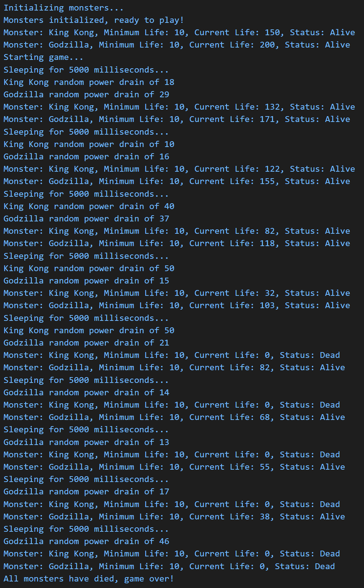

# Project 5
[RETURN TO HOMEPAGE](https://connor-pfeiffer.github.io/)

## Learning Objectives:

After completing this project, you will:

1. Gain experience working with classes, including class constructors and methods

2. Gain experience interpreting existing code to design a new class, including constructor and methods

3. Gain more experience working with code modules

4. Gain experience executing and debugging Node.js code using VSCode, including module breakpoints

5. Gain more experience working with Array map() and forEach() methods

6. Gain experience working with the concept of a gaming loop

7. Gain more experience working with objects and arrays

## Overview:

For this project, you will create a Monster Game program using classes. The game will create monsters with initial life values, and minimum life values for the monster to be alive. Once the game is running, each monster's life will be drained by a random amount, and the game will continue until all of the monsters have died. The game will include a delay before each life drain.

Example output

## Project Deliverables:

1. [p5.js](p5.js)

2. [p5-monster-game.js](p5-monster-game.js)

3. [p5-monster.js](p5-monster.js)
